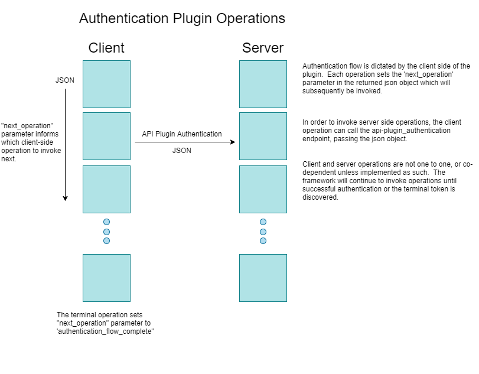

## Motivation
The current iRODS authentication mechanism is driven by the client calling a series of 5 operations provided by the authentication plugin interface.  This is a rigid abstraction that does not afford the necessary flexiblity to adapt to modern identity management.  This framework provides an open ended authentication flow which allows the client side operations to dictate the flow to the framework.  An API plugin is provided to generically invoke server side authentication operations which may interact with the iRODS agent or external services.



## Authentication Framework

### The authentication_base class
The framework provides a pure virtual base class from which specific implementations may be derived. It enforces the need for the implementation of `json auth_client_start(rcComm_t* comm, const json& req)` which is the first client side operation invoked by the provided `authenticate_client(rcComm_t* comm, const rodsEnv& env)` method.  Any other functionality is expected to be implemented by the plugin itself and then wired into the operations table using the `add_operation` member function during construction.

### The json message passing
Each operation within the authentication plugin framework takes a json object as input and returns a json object as output.  As the flow cascades the output of a previous operation is passed into the next operation, which gives the implementors the opportunity to continue the flow of information from operation to operation.  Given that these are json objects, they may have as complex a structure as desired as long as they contain the `next_operation` paramter at the root of the object.

### Plugin resolution
The framework provides a function to load either the client or server side plugins for operation invocation.  When creating a new authentication plugin, these plugins must conform to a given naming scheme.  For example, the currently implemented native authentication plugin generates the two following shared objects:
``` cpp
libirods-authentication_plugin-native_client.so
libirods-authentication_plugin-native_server.so
```
The authentication scheme that maps to these plugins is: `irods-authentication_plugin-native`  The plugin framework itself adds the `lib` and the `_client` or `_server` to the name of the shared object.  The shared objects themselves must also be packaged to be installed into `/usr/lib/irods/plugins/authentication/`.

### Client side authentication
The `authenticate_client(rcComm_t* comm, const rodsEnv& env)` method is used on the client side to walk the authentcation flow as provided by the specified authentication plugin.  It will continue to inspect the returned json objects for a `next_operation` key-value pair, set up the request object with the returned information, and then invoke the next operation via the `json call(rcComm_t* comm, const std::string& n, const json& req)`

### Server side invocation
Server side operations can be invoked by the client side through the `auto request(rcComm_t* comm, const json& msg)` method.  This method invokes the requested server side operation as indicated by the `next_operation` parameter in the json object passed into the function.  This provides a simple mechanism for server side plugin implementation leveraging the same interface as the plugin operations.
